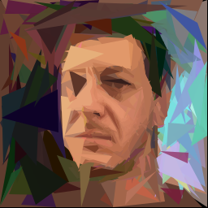

# Tri-Klops

Tri-Klops is a Rust program that approximates a reference image using a set number of triangles. It uses an evolutionary algorithm to iteratively add triangles to a canvas, evolving each one to best match the reference image.



## Features

- **Evolutionary Algorithm**: Uses genetic algorithms to create images from triangles
- **Fitness Evaluation**: Supports two metrics:
  - **Mean Squared Error (MSE)**
  - **Structural Similarity Index Measure (SSIM)**
- **Parallel Processing**: Melt your CPU!
- **Customizable Parameters**: Control the number of triangles, generations, population size, mutation rate, and more
- **SVG Output**: Generates scalable vector graphics output
- **Degeneracy Control**: Optional threshold to prevent degenerate triangles
- **Progressive Saving**: Configurable frequency for saving intermediate results

## Dependencies

- Rust (stable)
- Crates
  - `clap`: Command-line argument parsing
  - `image`: Image processing
  - `imageproc`: Drawing operations
  - `indicatif`: Progress bars
  - `rand`: Random number generation
  - `rayon`: Parallel processing
  - `svg`: SVG file generation

## Installation

Clone the repository:

```bash
git clone https://github.com/kkestell/tri-klops.git
cd tri-klops
```

Build the project:

```bash
cargo build --release
```

## Usage

### Command-Line Arguments

<dl>
  <dt><code>reference_image_path</code></dt>
  <dd>Path to the reference image file. Required.</dd>
  <dt><code>--image_size</code></dt>
  <dd>Width and height of the output image in pixels. Default: 256</dd>
  <dt><code>--num_triangles</code></dt>
  <dd>Total number of triangles to use in the approximation. Default: 512</dd>
  <dt><code>--num_generations</code></dt>
  <dd>Number of generations to evolve each triangle. Default: 512</dd>
  <dt><code>--population_size</code></dt>
  <dd>Size of the population in each generation. Default: 512</dd>
  <dt><code>--num_selected</code></dt>
  <dd>Number of top individuals selected per generation. Default: 256</dd>
  <dt><code>--mutation_rate</code></dt>
  <dd>Mutation rate for the evolutionary algorithm (between 0 and 1). Default: 0.1</dd>
  <dt><code>--seed</code></dt>
  <dd>Seed for the random number generator. Optional.</dd>
  <dt><code>--algorithm</code></dt>
  <dd>Fitness evaluation algorithm to use ("ssim" or "mse"). Default: "mse"</dd>
  <dt><code>--degeneracy_threshold</code></dt>
  <dd>Minimum angle threshold for triangle vertices in degrees. Optional.</dd>
  <dt><code>--save_frequency</code></dt>
  <dd>Number of triangles between intermediate saves. When not specified, defaults to saving every 10 triangles. Set to 0 to disable intermediate saves.</dd>
</dl>

### Example Commands

Basic usage with default settings:

```bash
cargo run --release -- path/to/reference_image.jpg
```

Custom configuration:

```bash
cargo run --release -- path/to/reference_image.jpg \
  --image_size 512 \
  --num_triangles 1000 \
  --num_generations 1000 \
  --population_size 512 \
  --num_selected 256 \
  --mutation_rate 0.05 \
  --algorithm ssim \
  --degeneracy_threshold 10.0 \
  --save_frequency 20
```

### Examples

<table>
  <thead>
    <tr>
      <th>Reference Image</th>
      <th>Output Image</th>
    </tr>
  </thead>
  <tbody>
    <tr>
      <td>
          
      </td>
      <td>
          
      </td>
    </tr>
    <tr>
      <td>
          
      </td>
      <td>
          
      </td>
    </tr>
    <tr>
      <td>
          
      </td>
      <td>
          
      </td>
    </tr>
  </tbody>
</table>

### Output Files

The program generates an SVG file with the naming format:

```
{input_filename}--alg_{algorithm}--rng_{seed}--res_{image_size}--tri_{num_triangles}--gen_{num_generations}--pop_{population_size}--sel_{num_selected}--mut_{mutation_rate}--deg_{degeneracy_threshold}.svg
```

## How It Works

The program uses an evolutionary algorithm to approximate the reference image with triangles:

For each new triangle:

- Generates a random population of triangles
- Evaluates each triangle's fitness using MSE or SSIM
- Selects the best performers for breeding
- Creates new generations through crossover and mutation
- Optional: Checks for and penalizes degenerate triangles

After evolving each triangle:

- Adds the best-performing triangle to the canvas
- Updates the SVG output
- Optionally saves intermediate results based on save frequency

## Fitness Algorithms

### MSE (Mean Squared Error)

- Measures average pixel-wise difference
- Faster computation
- Good for general purpose use

### SSIM (Structural Similarity Index)

- Considers image structure and perception
- More computationally intensive
- Often produces more visually pleasing results

## License

This project is licensed under the Zero-Clause BSD License. See the [LICENSE](LICENSE) file for details.
```
Permission to use, copy, modify, and/or distribute this software for
any purpose with or without fee is hereby granted.

THE SOFTWARE IS PROVIDED “AS IS” AND THE AUTHOR DISCLAIMS ALL
WARRANTIES WITH REGARD TO THIS SOFTWARE INCLUDING ALL IMPLIED WARRANTIES
OF MERCHANTABILITY AND FITNESS. IN NO EVENT SHALL THE AUTHOR BE LIABLE
FOR ANY SPECIAL, DIRECT, INDIRECT, OR CONSEQUENTIAL DAMAGES OR ANY
DAMAGES WHATSOEVER RESULTING FROM LOSS OF USE, DATA OR PROFITS, WHETHER IN
AN ACTION OF CONTRACT, NEGLIGENCE OR OTHER TORTIOUS ACTION, ARISING OUT
OF OR IN CONNECTION WITH THE USE OR PERFORMANCE OF THIS SOFTWARE.
```
