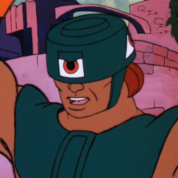
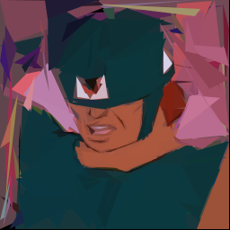
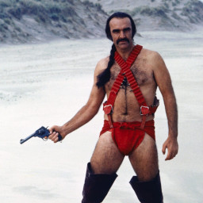
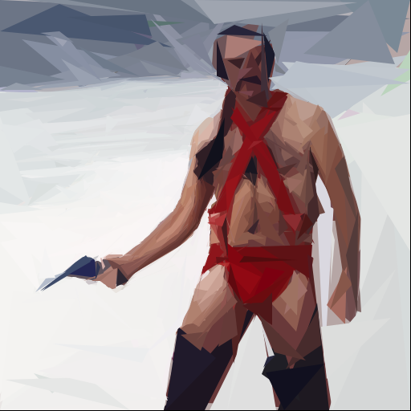
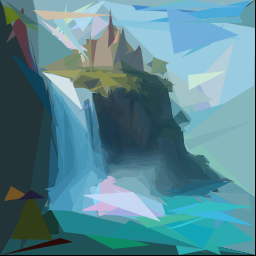
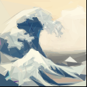

# Tri-Klops

Create images from triangles using a genetic algorithm.

<p align="center">
    
</p>

## Usage

```
triklops [OPTIONS] <REFERENCE_IMAGE_PATH>

Arguments:
  <REFERENCE_IMAGE_PATH>  Path to the reference image

Options:
      --image-size <IMAGE_SIZE>
          Image size (width and height) [default: 256]
      --num-triangles <NUM_TRIANGLES>
          Number of triangles [default: 512]
      --num-generations <NUM_GENERATIONS>
          Number of generations [default: 512]
      --population-size <POPULATION_SIZE>
          Population size [default: 512]
      --num-selected <NUM_SELECTED>
          Number of individuals selected per generation [default: 256]
      --mutation-rate <MUTATION_RATE>
          Mutation rate [default: 0.1]
      --seed <SEED>
          Seed for the random number generator (optional)
      --degeneracy-threshold <DEGENERACY_THRESHOLD>
          Degeneracy threshold (optional)
      --algorithm <ALGORITHM>
          Fitness evaluation algorithm ("ssim" or "mse") [default: mse] [possible values: ssim, mse]
      --save-frequency <SAVE_FREQUENCY>
          Save frequency (optional)
  -h, --help
          Print help
```

### Examples

Basic usage with default settings:

```bash
cargo run --release -- path/to/reference_image.jpg
```

Custom configuration:

```bash
cargo run --release -- path/to/reference_image.jpg \
  --image-size 512 \
  --num-triangles 1000 \
  --num-generations 1000 \
  --population-size 512 \
  --num-selected 256 \
  --mutation-rate 0.05 \
  --algorithm ssim \
  --degeneracy-threshold 10.0 \
  --save-frequency 20
```

### More Examples

<table>
  <thead>
    <tr>
      <th>Reference Image</th>
      <th>Output Image</th>
    </tr>
  </thead>
  <tbody>
    <tr>
      <td>
          
      </td>
      <td>
          
      </td>
    </tr>
  </tbody>
</table>

```
cargo run --release -- examples/tri-klops.jpg \
    --image-size 256 \
    --num-triangles 256 \
    --num-generations 256 \
    --population-size 256 \
    --num-selected 128 \
    --mutation-rate 0.10 \
    --algorithm mse
```

<table>
  <thead>
    <tr>
      <th>Reference Image</th>
      <th>Output Image</th>
    </tr>
  </thead>
  <tbody>
    <tr>
      <td>
          
      </td>
      <td>
          
      </td>
    </tr>
  </tbody>
</table>

```
cargo run --release -- examples/zardoz.jpg \
    --image-size 512 \
    --num-triangles 512 \
    --num-generations 512 \
    --population-size 128 \
    --num-selected 64 \
    --mutation-rate 0.10 \
    --algorithm ssim
```

<table>
  <thead>
    <tr>
      <th>Reference Image</th>
      <th>Output Image</th>
    </tr>
  </thead>
  <tbody>
    <tr>
      <td>
          
      </td>
      <td>
          
      </td>
    </tr>
  </tbody>
</table>

```
cargo run --release -- examples/castle.jpg \
    --image-size 256 \
    --num-triangles 512 \
    --num-generations 512 \
    --population-size 512 \
    --num-selected 256 \
    --mutation-rate 0.10 \
    --algorithm mse
```

<table>
  <thead>
    <tr>
      <th>Reference Image</th>
      <th>Output Image</th>
    </tr>
  </thead>
  <tbody>
    <tr>
      <td>
          
      </td>
      <td>
          
      </td>
    </tr>
  </tbody>
</table>

```
cargo run --release -- examples/kanagawa.jpg \
    --image-size 128 \
    --num-triangles 512 \
    --num-generations 512 \
    --population-size 128 \
    --num-selected 64 \
    --mutation-rate 0.10 \
    --algorithm ssim
```
