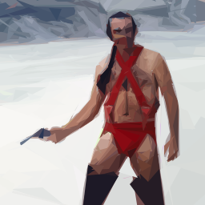
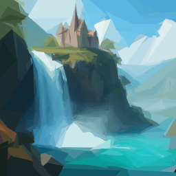

# Tri-Klops

Create images from triangles using a genetic algorithm.

<p align="center">
    
</p>

## Installation

### Windows

Download the latest release from the [releases page](https://github.com/kkestell/tri-klops/releases) and run the installer.

Tri-Klops will be installed to `%LOCALAPPDATA%\Programs\Tri-Klops`. A shortcut will be (optionally) created on the desktop which launches PowerShell with `triklops.exe` in the `PATH`.

### MacOS / Linux

No installers yet. Sorry.

## Usage

```
Tri-Klops

Usage: triklops [OPTIONS] <REFERENCE_IMAGE_PATH>

Arguments:
  <REFERENCE_IMAGE_PATH>  Path to the reference image

Options:
  -o, --output <OUTPUT_PATH>
          Output path (optional)
  -t, --num-triangles <NUM_TRIANGLES>
          Number of triangles [default: 512]
  -i, --image-size <IMAGE_SIZE>
          Image size (width and height) [default: 256]
  -g, --num-generations <NUM_GENERATIONS>
          Number of generations [default: 256]
  -p, --population-size <POPULATION_SIZE>
          Population size [default: 128]
  -s, --num-selected <NUM_SELECTED>
          Number of individuals selected per generation [default: 64]
  -m, --mutation-rate <MUTATION_RATE>
          Mutation rate [default: 0.1]
  -d, --degeneracy-threshold <DEGENERACY_THRESHOLD>
          Degeneracy threshold (optional)
  -f, --save-frequency <SAVE_FREQUENCY>
          Save frequency [default: 1]
  -r, --seed <SEED>
          Seed for the random number generator (optional)
  -T, --threads <THREADS>
          Number of threads to use (optional)
  -h, --help
          Print help
```

### Examples

Basic usage with default settings:

```bash
cargo run --release -- path/to/reference_image.jpg
```

Custom configuration:

```bash
cargo run --release -- path/to/reference_image.jpg \
  --image-size 512 \
  --num-triangles 1000 \
  --num-generations 1000 \
  --population-size 512 \
  --num-selected 256 \
  --mutation-rate 0.05 \
  --degeneracy-threshold 10.0 \
  --seed 42 \
  --threads 4 \
  --save-frequency 20
```

### More Examples

<table>
  <thead>
    <tr>
      <th>Reference Image</th>
      <th>Output Image</th>
    </tr>
  </thead>
  <tbody>
    <tr>
      <td>
          
      </td>
      <td>
          
      </td>
    </tr>
  </tbody>
</table>

```
cargo run --release -- examples/zardoz.jpg \
    --image-size 512 \
    --num-triangles 1024 \
    --num-generations 256 \
    --population-size 128 \
    --num-selected 64 \
    --mutation-rate 0.15 \
    --degeneracy-threshold 10.0
```

<table>
  <thead>
    <tr>
      <th>Reference Image</th>
      <th>Output Image</th>
    </tr>
  </thead>
  <tbody>
    <tr>
      <td>
          
      </td>
      <td>
          
      </td>
    </tr>
  </tbody>
</table>

```
cargo run --release -- examples/castle.jpg \
    --image-size 256 \
    --num-triangles 512 \
    --num-generations 512 \
    --population-size 512 \
    --num-selected 256 \
    --mutation-rate 0.1
```

<table>
  <thead>
    <tr>
      <th>Reference Image</th>
      <th>Output Image</th>
    </tr>
  </thead>
  <tbody>
    <tr>
      <td>
          
      </td>
      <td>
          
      </td>
    </tr>
  </tbody>
</table>

```
cargo run --release -- examples/kanagawa.jpg \
    --image-size 256 \
    --num-triangles 512 \
    --num-generations 256 \
    --population-size 128 \
    --num-selected 64 \
    --mutation-rate 0.1
```
