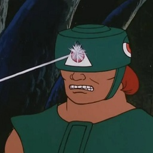
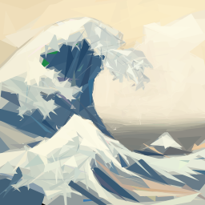

# Tri-Klops

Create images from triangles using a genetic algorithm.

    

## Installation

Download the latest release from the [releases page](https://github.com/kkestell/tri-klops/releases) on GitHub.

## Examples

<table>
  <thead>
    <tr>
      <th>Reference Image</th>
      <th>Output Image</th>
    </tr>
  </thead>
  <tbody>
    <tr>
      <td>
          
      </td>
      <td>
          
      </td>
    </tr>
    <tr>
      <td>
          
      </td>
      <td>
          
      </td>
    </tr>
    <tr>
      <td>
          
      </td>
      <td>
          
      </td>
    </tr>
    <tr>
      <td>
          
      </td>
      <td>
          
      </td>
    </tr>
  </tbody>
</table>
